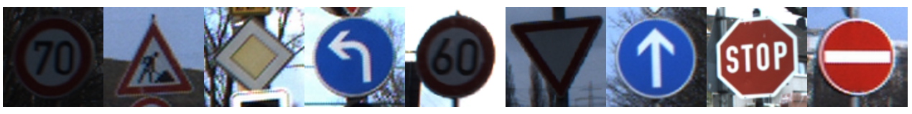

# Machine Learning Engineer Nanodegree
## Capstone Proposal
Liangyuan Tian  
Feburary 28th, 2017

## Proposal

### Domain Background
Recent advancement in autonomous vehicles has shown the once fictional technology is gradually becoming reality in the near future. In the foreseeable future, vehicles of various automation levels will coexist on the road. Thus it is crucial for automated driving machines able to recognise and interpret the meaning of traffic signs and follow traffic rules.

### Problem Statement
In this project, a automatic traffic sign recognition system will be built to categorize various traffic sign images. A deep convolutional neural network will be trained on various traffic sign images, its performance should exceed human accuracy to provide the highest safety for autonomous vehicles.

### Datasets and Inputs
[GTSRB](http://benchmark.ini.rub.de/?section=gtsrb&subsection=news) is a multi-class, single-image dataset consists of 50,000+ traffic sign images with 40 classes collected in Germany. Some of the images smaples are shown below.

The system to be built in this project will use the images in the dataset as input, and the class category as output. Data can be downloaded from the official website [http://benchmark.ini.rub.de/?section=gtsrb&subsection=dataset](http://benchmark.ini.rub.de/?section=gtsrb&subsection=dataset). These large amount of images are collect in real life, thus very suitable to be used as training data for the learning model.
### Solution Statement
The system will use the state of art convolutional nerual network with many advanced techniques include but not limited to image augmentation, image preprocessing, multi-scale convolutional nerual network, etc. Furthermore, other advanced methods such as spatial transform network will be experimented to achieve the best performance. The final accuracy of the model will be tested on the unseen test dataset percentage wise. 

### Benchmark Model
Many prior researches have been conducted on this dataset. The best published results are listed in the table below.

|Method|Accuracy|
|------|--------|
|Committee of CNNs|99.46%|
|Color-blob-based COSFIRE filters for object recogn|98.97%|
|Human Performance|98.84%|
|Multi-Scale CNNs|98.31%|
|Random Forests|96.14%|
|LDA on HOG 2|95.68%|
|LDA on HOG 1|93.18%|
|LDA on HOG 3|92.34%|

### Evaluation Metrics
The performance of the system is evaluated by prediction accuracy on test dataset, which is also provided on the official website.

### Project Design
The project will be organized as the following processes.

#### Data Exploration
The amount of data and its distribution will be analized to give insights how to handle the data.
#### Data Augmentation
Data augmentation is a standard practice on image data classification, this approach create more training data to help model improve. Common practices include sheer, scale, translate, brightness change.
#### Preprocessing
Experiment preprocessing methods such as normalization and black and white conversion.
#### Design Convolutional Nerual network
Various architecture of convolutional network will be experimented to gain the best performance. Techniques such as regularization, dropout, multi-scale features will be tested.
#### Training and Parameter Tuning
Various training methods and parameter sets will be tried out to optimize the model performance.
#### Experiments
Experiment more advanced techniques such as transfer learning or spatial transform network.
#### Summary
Write project report, summarize project achievements and further research directions.

### Reference
J. Stallkamp, M. Schlipsing, J. Salmen, C. Igel, Man vs. computer: Benchmarking machine learning algorithms for traffic sign recognition, Neural Networks, Available online 20 February 2012, ISSN 0893-6080, 10.1016/j.neunet.2012.02.016. (http://www.sciencedirect.com/science/article/pii/S0893608012000457) Keywords: Traffic sign recognition; Machine learning; Convolutional neural networks; Benchmarking